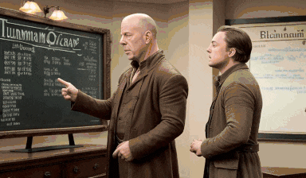

# Fase1
A stupid low cost extension to make variations in-seed.

**What is Fase1?** Fase1 is a script to generate a sequence of images from weird symbols of my keyboard.\
**Why does this trick work?** Because all the language models use word stems. So if you include random variations in one word it will not change their embedding.\
**When did you discover it?** It was one of the first thing I tried when SD 1.4 was released.\
**How can I create videos?** Fase1 is a draft for now. You can generate gifs or videos with ImageMagick, ffmpeg or web services.\
**Where?** Only for Automatic1111.

**Contribute** Please share your ideas to improve this extension. If you find other modifiers: Kanjis, Greek, Cyrillic, Arabic, Amazigh, emojis... or you want optimize the code send me your issues or pull requests.

## Quick Start

*	Go to extensions tab
*	Click in section "Install from URL"
*	Paste https://github.com/jisqrt/Fase1.git and click Install
*	Restart the Web UI
*	Be happy

## How to use

1. Write a prompt and generate your image.
2. Click on recycle the last seed.
3. Activate the extension.
4. Use the first slider to select a word of your prompt (count the position).
5. On section Modifiers choose one of them, with the slider select the number of iterations of that modifier. If you want play with others options.
6. Press Generate and wait.
7. Read the wiki for more info.

## Examples

	
Proof of the spanish supremacy even with english LLM 😉. Add 30 ñ to second word.

 

Prompt: a woman waking in the beach
Steps: 20, Sampler: Euler a, CFG scale: 7, Seed: 3999234505, Size: 448x448, Model hash: 9aba26abdf, Model: deliberate_v2

Complex prompt: ñ power again, word = 3. 105 iterations + original. Sorry for color compression.

 

Prompt: Bruce Willis acting as a hobbit explain Quantum mechanics to Leonardo DiCaprio on the Big Bang Theory blackboard, incredible cinematic scene, epic volumetric CGI, applause 
Negative Prompt: lowres, cartoon 
Steps: 20, Sampler: DDIM, CFG scale: 7, Seed: 4045654228, Size: 768x448, Model hash: 9aba26abdf, Model: deliberate_v2

## TODO

- [ ] Reverse CFG travel
- [ ] Add video generation
- [ ] Experiments with external c++ library for Fase2
- [ ] Profits (not really)

### Credits
Special Thanks to StylePile extension your code inspired this script.\
Automatic1111 web-ui.\
All open source community.